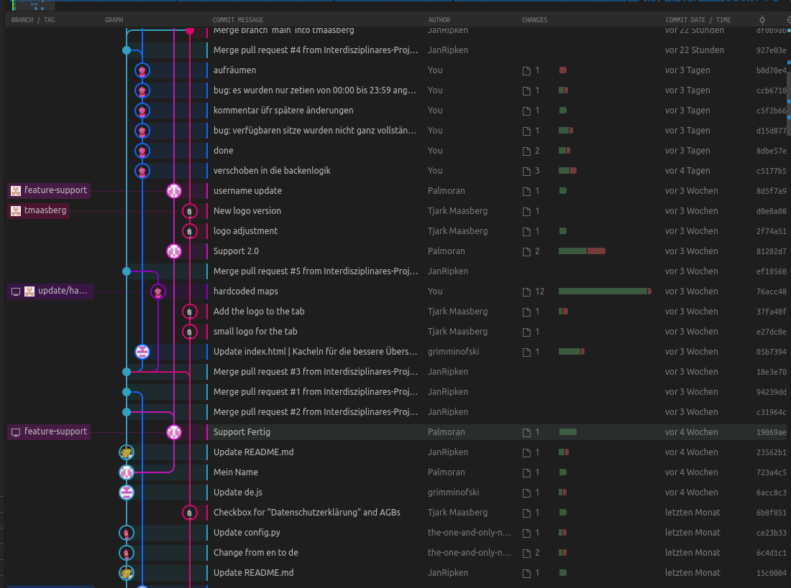

# Einführung
Desk24 ist eine intuitive Webanwendung, die es Ihren Mitarbeitern ermöglicht, Tische und Sitzplätze ohne umfangreiches Vorwissen zu buchen. Mit Desk24 können Benutzer einfach einen Tisch für einen bestimmten Tag und Zeitraum reservieren, alle Buchungen einsehen, bei Bedarf stornieren und Feedback zu den Sitzplätzen geben. Als Administrator haben Sie die Möglichkeit, alle Buchungen einzusehen, eine umfassende Statistik zu generieren und neue Zonen anzulegen, die beispielsweise als Stockwerke betrachtet werden können.

Desk24 bietet eine benutzerfreundliche Oberfläche, die es Ihren Mitarbeitern ermöglicht, bequem auf die verfügbaren Sitzplätze zuzugreifen und diese zu reservieren. Es erfordert kein umfangreiches technisches Know-how, sodass Ihre Mitarbeiter schnell und einfach mit der Buchung von Tischen und Sitzplätzen beginnen können.

Als Administrator haben Sie die Kontrolle über das gesamte System. Sie können alle Buchungen einsehen und verwalten, um sicherzustellen, dass alles reibungslos abläuft. Desk24 ermöglicht es Ihnen auch, benutzerdefinierte Zonen einzurichten, die den verschiedenen Bereichen Ihres Unternehmens entsprechen. Dies kann nützlich sein, um beispielsweise verschiedene Stockwerke, Abteilungen oder Teams zu repräsentieren.

Desk24 bietet außerdem umfassende Analysemöglichkeiten. Als Administrator können Sie Statistiken generieren, um Einblicke in die Auslastung der Sitzplätze, beliebte Buchungszeiten oder andere relevante Metriken zu erhalten. Diese Informationen können dabei helfen, Ressourcen effizienter zu nutzen und die Arbeitsumgebung für Ihre Mitarbeiter zu optimieren.

Mit Desk24 können Sie den Buchungsprozess vereinfachen, die Transparenz verbessern und die Nutzung der verfügbaren Sitzplätze maximieren. Ganz gleich, ob es sich um ein Büro, ein Coworking-Space oder eine öffentliche Einrichtung handelt, Desk24 ist die ideale Lösung, um Ihre Arbeitsplatzbuchungen effizient zu verwalten und das Nutzererlebnis zu verbessern.

# Installation

### Ubuntu
```bash
#Docker installation
sudo apt-get update

sudo apt-get install ca-certificates curl gnupg

sudo install -m 0755 -d /etc/apt/keyrings

curl -fsSL https://download.docker.com/linux/ubuntu/gpg | sudo gpg --dearmor -o /etc/apt/keyrings/docker.gpg

sudo chmod a+r /etc/apt/keyrings/docker.gpg

echo \
  "deb [arch="$(dpkg --print-architecture)" signed-by=/etc/apt/keyrings/docker.gpg] https://download.docker.com/linux/ubuntu \
  "$(. /etc/os-release && echo "$VERSION_CODENAME")" stable" | \
  sudo tee /etc/apt/sources.list.d/docker.list > /dev/null

sudo apt-get update

sudo apt-get install docker-ce docker-ce-cli containerd.io docker-buildx-plugin docker-compose-plugin
```

``` bash

git clone https://github.com/Interdisziplinares-Projekt/Desk24.git
cd desk24
(sudo) docker compose -f demo_compose.yaml up
```


### Windows
Um unter Windows Docker Desktop zum laufen zu bekommen folgen sie bitte der Anleitung unter diesem link [Docker Desktop for Windows](https://docs.docker.com/desktop/install/windows-install/)

```powershell
git clone https://github.com/Interdisziplinares-Projekt/Desk24.git
cd desk24
docker compose -f demo_compose.yaml up
```

### Mac
Für die Installation von Docker Desktop folgenden sie bitte dieser Anleitung [Docker Desktop for Mac](https://docs.docker.com/desktop/install/mac-install/)

```terminal
git clone https://github.com/Interdisziplinares-Projekt/Desk24.git
cd desk24
docker compose -f demo_compose.yaml up
```


### Login 
Auf die Webanwendung kommen sie mit http://127.0.0.1:8080 und die Login Daten für den Admin sind **Admin** und als Passwort **noneshallpass** 


# Entwicklerinstallation
### Ubuntu
```bash
#python3
sudo apt update && sudo apt upgrade
sudo apt install python3 python3-pip


#nodejs, npm und nvm
curl -o- https://raw.githubusercontent.com/nvm-sh/nvm/v0.39.3/install.sh | bash
source ~/.nvm/nvm.sh
nvm --version
nvm install node

node --version
npm --version


#postgresql
sudo apt update && sudo apt upgrade
sudo apt install postgresql

sudo systemctl status postgresql

# Datenbank und nutzern anlegen
sudo -u postgres psql

CREATE USER warp WITH PASSWORD 'warp';

CREATE DATABASE warp;

GRANT ALL PRIVILEGES ON DATABASE warp TO warp;

# Testen
psql -U warp -d warp -h localhost -p 5432
```

```bash
git clone https://github.com/Interdisziplinares-Projekt/Desk24.git
cd desk24

pip3 install -r requirements.txt


pushd js
npm ci
npm run build
popd

export FLASK_APP=desk24
export FLASK_ENV=development

flask run
```


### Zugriff ohne Installation
Da wir niemanden zwingen möchten, Docker zu installieren, und die Installation für Entwickler ebenfalls etwas komplexer ist, haben wir in Absprache mit dem Fachschaftsrat einen Raspberry Pi an der Jade HS installiert. Auf diesem Raspberry Pi läuft die Serverseite der Anwendung. Das bedeutet, dass Sie über folgenden Link [Desk24]() auf die Webseite zugreifen können, solange Sie sich in der Jade HS befinden oder über VPN mit der Jade HS verbunden sind.


# Fehlerbehebung
Falls die .env-Variable im Code keinen Wert findet, kann dies daran liegen, dass Flask in einer zu neuen Version vorliegt und Node nicht aktuell genug ist.
```bash
node --version
flask --version
```

Wenn diese Befehle zeigen, dass Node unter 14.0 und Flask 2.3 ist, müssen einige Anpassungen vorgenommen werden:

```bash
curl -o- https://raw.githubusercontent.com/nvm-sh/nvm/v0.39.0/install.sh | bash
nvm list-remote
nvm install {latest-lts-version}

(sudo) pip uninstall flask
pip install flask==2.2

```


# Entwicklung
Um am Projekt Desk24 mitzuwirken, bitten wir Sie, wie folgt vorzugehen:

Erstellen Sie einen Fork des Repositories, indem Sie auf den "Fork" Button oben rechts auf der GitHub-Seite klicken. Dadurch wird eine Kopie des Repositories in Ihrem eigenen GitHub-Account erstellt.

Klonen Sie nun das geforkte Repository auf Ihren lokalen Computer, indem Sie den folgenden Befehl in Ihrem Terminal oder Ihrer Eingabeaufforderung ausführen:

```bash
git clone <URL Ihres geforkten Repositories>
```
Ersetzen Sie <URL Ihres geforkten Repositories> durch den URL-Link zu Ihrem geforkten Repository.

Fügen Sie Ihre Änderungen zu Ihrem lokalen Repository hinzu und führen Sie die entsprechenden Git-Befehle aus, um Ihre Änderungen zu commiten und zu pushen. Dies kann beispielsweise die Aktualisierung von Code, das Hinzufügen neuer Funktionen oder das Beheben von Fehlern beinhalten.

Öffnen Sie einen neuen Pull Request (PR), um Ihre Änderungen in das ursprüngliche Projekt einzubringen. Gehen Sie dazu auf die GitHub-Seite Ihres geforkten Repositories, klicken Sie auf den "Pull Request" Button und folgen Sie den Anweisungen, um den PR zu erstellen.

Wir werden Ihre Änderungen überprüfen und in das Hauptprojekt integrieren, sofern sie den Anforderungen und Richtlinien entsprechen.

Vielen Dank für Ihre Mitwirkung am Desk24-Projekt!


# Feature Driven Development (FDD)
Um eine einheitliche Softwareentwicklungsmethode aus dem agilen Bereich zu verwenden, haben wir uns für das Feature Driven Development (FDD) entschieden. Das Feature Driven Development ist eine agile Softwareentwicklungsmethode, die sich auf die iterative und inkrementelle Entwicklung von Software konzentriert. Sie legt einen starken Fokus auf die Definition und Umsetzung von Features, die einen messbaren Mehrwert für den Benutzer bieten.




# Verzeichnisstruktur

- demo_compose.yaml: Eine YAML-Datei, die eine Konfiguration für Docker Compose enthält.

- desk24: Das Hauptverzeichnis des Projekts.

- static: Ein Verzeichnis, das statische Dateien für das Frontend enthält.

- dist: Ein Verzeichnis, das kompilierte oder generierte statische Dateien enthält.

- i18n: Ein Verzeichnis, das Übersetzungsdateien für verschiedene Sprachen enthält.

- images: Ein Verzeichnis, das Bilder für das Frontend enthält.

- material_icons: Ein Verzeichnis, das Material Icons und zugehörige CSS-Dateien enthält.

- materialize: Ein Verzeichnis, das die Materialize CSS-Bibliothek enthält.

- templates: Ein Verzeichnis, das Vorlagendateien für das Frontend enthält.

- xhr: Ein Verzeichnis, das Dateien für AJAX-Anfragen (XMLHttpRequest) enthält.

- Dockerfile: Eine Datei, die Anweisungen zum Erstellen eines Docker-Images für das Projekt enthält.

- js: Ein Verzeichnis, das JavaScript-Quellcode für das Frontend enthält.

- base: Ein Verzeichnis, das Basis-JavaScript-Dateien und Stildefinitionen enthält.

- views: Ein Verzeichnis, das JavaScript-Dateien für verschiedene Seiten des Frontends enthält.

- package.json und package-lock.json: Dateien, die Abhängigkeiten und Konfigurationen für den Node.js-Paketmanager (npm) enthalten.

- webpack.config.js: Eine Dateidie ,die Konfiguration für den Webpack-Bundler enthält.

- LICENSE: Eine Lizenzdatei, die die Bedingungen für die Nutzung des Projekts angibt.

- MANIFEST.in: Eine Datei, die verwendet wird, um zusätzliche Dateien in ein Python-Paket einzuschließen.

- requirements.txt: Eine Datei, die die erforderlichen Python-Pakete und -Versionen für das Projekt auflistet.

- res: Ein Verzeichnis, das verschiedene Ressourcen für das Projekt enthält.

- assets: Ein Verzeichnis, das Assets wie Bilder oder Dokumentationen enthält.

- desk24_uwsgi.ini: Eine INI-Konfigurationsdatei für den uWSGI-Server.

- nginx.conf: Eine Konfigurationsdatei für den NGINX-Webserver.

- setup.py: Eine Datei, die normalerweise verwendet wird, um Informationen zum Projekt und den Installationsanweisungen anzugeben.


```bash
.
├── demo_compose.yaml
├── desk24
│   ├── auth_mellon.py
│   ├── auth.py
│   ├── blob_storage.py
│   ├── config.py
│   ├── db.py
│   ├── __init__.py
│   ├── sql
│   │   ├── clean_db.sql
│   │   ├── sample_data.sql
│   │   └── schema.sql
│   ├── static
│   │   ├── dist
│   │   │   ├── 738.7f180b0c56fe3212b48c.css
│   │   │   ├── 911.06f44f4ddedd1a9d030c.js
│   │   │   ├── 976.286feaea85d858a4d449.js
│   │   │   ├── base.f6096d2a918bbbb58a46.css
│   │   │   ├── base.f8e606ed2763b14ef90e.js
│   │   │   ├── bookings.8bef9ef80b0a8a84dcbb.js
│   │   │   ├── groupAssign.e784b94b3579aaa9fbdb.js
│   │   │   ├── groups.22edcc90afee025a14e0.js
│   │   │   ├── users.3e477da11e729c8d3fb3.js
│   │   │   ├── webpack_runtime.be4546cd7f1173976ceb.js
│   │   │   ├── zone.07dfdb5c22e0fad28df9.js
│   │   │   ├── zone.4b353410ba82bbbe70b2.css
│   │   │   ├── zoneAssign.3aca4c5c19e445ee0db4.js
│   │   │   ├── zoneModify.9cad1e8580a348b91c57.js
│   │   │   └── zones.6577ac943faec0ed2e24.js
│   │   ├── i18n
│   │   │   ├── de.js
│   │   │   ├── en.js
│   │   │   ├── es.js
│   │   │   └── pl.js
│   │   ├── images
│   │   │   ├── excel_icon.png
│   │   │   ├── favicon.png
│   │   │   ├── help_icon.png
│   │   │   ├── logo-color.png
│   │   │   ├── logo_desk24_35-12pixel.png
│   │   │   ├── logo_desk24.png
│   │   │   ├── logo_desk24_schwarz.png
│   │   │   ├── logo.png
│   │   │   ├── schedule_icon_side.png
│   │   │   └── seat_icons.png
│   │   ├── material_icons
│   │   │   ├── material_icons.css
│   │   │   ├── MaterialIcons-Outlined_v81.woff
│   │   │   ├── MaterialIcons-Outlined_v81.woff2
│   │   │   ├── MaterialIcons-Regular_v109.woff
│   │   │   └── MaterialIcons-Regular_v109.woff2
│   │   └── materialize
│   │       ├── LICENSE
│   │       ├── materialize.min.css
│   │       └── materialize.min.js
│   ├── templates
│   │   ├── base.html
│   │   ├── base_logged.html
│   │   ├── bookings.html
│   │   ├── group_assign.html
│   │   ├── groups.html
│   │   ├── headers
│   │   │   ├── base.html
│   │   │   ├── bookings.html
│   │   │   ├── groupAssign.html
│   │   │   ├── groups.html
│   │   │   ├── users.html
│   │   │   ├── zoneAssign.html
│   │   │   ├── zone.html
│   │   │   ├── zoneModify.html
│   │   │   └── zones.html
│   │   ├── index.html
│   │   ├── login.html
│   │   ├── users.html
│   │   ├── zone_assign.html
│   │   ├── zone.html
│   │   ├── zone_modify.html
│   │   └── zones.html
│   ├── utils.py
│   ├── utils_tabulator.py
│   ├── view.py
│   └── xhr
│       ├── bookings.py
│       ├── groups.py
│       ├── __init__.py
│       ├── users.py
│       ├── zone.py
│       └── zones.py
├── Dockerfile
├── js
│   ├── base
│   │   ├── base.js
│   │   └── style.css
│   ├── package.json
│   ├── package-lock.json
│   ├── views
│   │   ├── bookings.js
│   │   ├── css
│   │   │   ├── tabulator
│   │   │   │   ├── tabulator_materialize.scss
│   │   │   │   ├── tabulator.scss
│   │   │   │   └── variables.scss
│   │   │   └── zone
│   │   │       └── nouislider_materialize.scss
│   │   ├── groupAssign.js
│   │   ├── groups.js
│   │   ├── modules
│   │   │   ├── bookas.js
│   │   │   ├── modal.js
│   │   │   ├── seat.js
│   │   │   ├── utils.js
│   │   │   ├── zoneModify_seat.js
│   │   │   └── zoneuserdata.js
│   │   ├── users.js
│   │   ├── zoneAssign.js
│   │   ├── zone.js
│   │   ├── zoneModify.js
│   │   └── zones.js
│   └── webpack.config.js
├── LICENSE
├── MANIFEST.in
├── README.md
├── requirements.txt
├── res
│   ├── assets
│   │   ├── git_graph.png
│   │   └── verzeichnisStruktur.txt
│   ├── desk24_maps
│   │   ├── etage_1bin.txt
│   │   ├── etage_2bin.txt
│   │   ├── Version_1.2_Etage_1_V1_Raumnummern.png
│   │   └── Version_1.2_Etage_2_V1_Raumnummern.png
│   ├── desk24_uwsgi.ini
│   └── nginx.conf
└── setup.py

```

